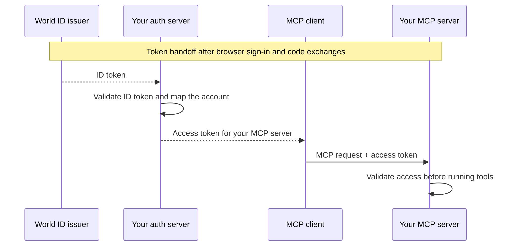

```mermaid
---
config:
    sequence:
        useMaxWidth: false
---
sequenceDiagram
    accTitle: World ID token handoff for your MCP server
    accDescr: After browser sign-in and code exchange, the World ID issuer returns an ID token to your auth server. Your auth server issues an access token to the MCP client, which uses it to call your MCP server.

    participant Issuer as World ID issuer
    participant Auth as Your auth server
    participant Client as MCP client
    participant MCP as Your MCP server

    Note over Issuer,MCP: Token handoff after browser sign-in and code exchanges
    Issuer-->>Auth: ID token
    Auth->>Auth: Validate ID token and map the account
    Auth-->>Client: Access token for your MCP server
    Client->>MCP: MCP request + access token
    MCP->>MCP: Validate access before running tools
```
