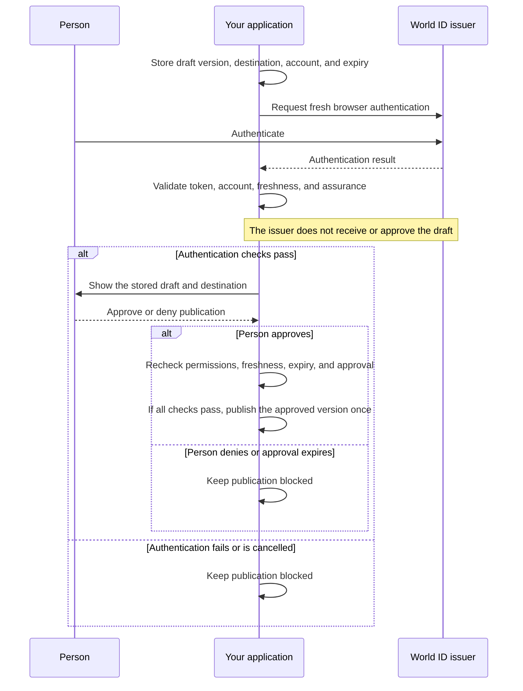

This example adds application-owned draft approval after fresh authentication.

```mermaid
sequenceDiagram
    accTitle: Authenticate a person and approve a draft in separate steps
    accDescr: The application stores a pending draft and requests fresh World ID authentication. After validating the result, the application shows the exact draft for approval. It publishes once only after rechecking the account, permissions, freshness, expiry, and approval.
    participant Person
    participant App as Your application
    participant Issuer as World ID issuer

    App->>App: Store draft version, destination, account, and expiry
    App->>Issuer: Request fresh browser authentication
    Person->>Issuer: Authenticate
    Issuer-->>App: Authentication result
    App->>App: Validate token, account, freshness, and assurance
    Note over App,Issuer: The issuer does not receive or approve the draft
    alt Authentication checks pass
        App->>Person: Show the stored draft and destination
        Person-->>App: Approve or deny publication
        alt Person approves
            App->>App: Recheck permissions, freshness, expiry, and approval
            App->>App: If all checks pass, publish the approved version once
        else Person denies or approval expires
            App->>App: Keep publication blocked
        end
    else Authentication fails or is cancelled
        App->>App: Keep publication blocked
    end
```

A changed draft or destination requires new approval. Enforce one-use execution
in backend storage.
