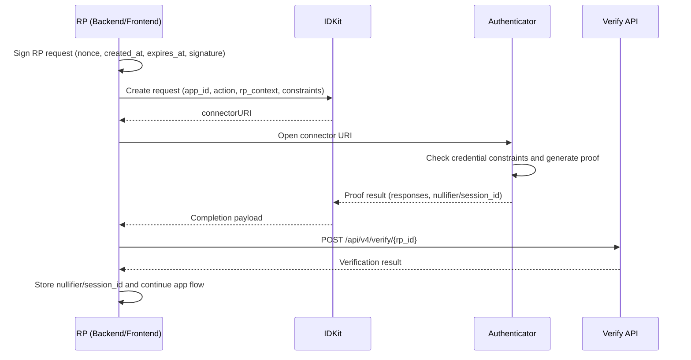

This section is for RPs and developers integrating World ID 4.0 with IDKit.

If you want the integration steps first, start with [IDKit Getting started](/world-id-4/idkit/getting-started).
For protocol context, see the [World ID 4.0 engineering overview](https://world.org/blog/engineering/introducing-world-id-4.0).

## High-level Flow

World ID 4.0 introduces an account-based model with authenticators, RP-signed requests, and proof verification.

At a high level:

1. Your backend signs a request (`rp_context`) for a specific action.
2. Your app uses IDKit to build a request with credential constraints and produces a connect URL.
3. The user completes the request in an Authenticator, which generates a proof.
4. Your backend verifies the proof via `POST /api/v4/verify/{rp_id}` and enforces your app logic.



<Note>
  In 4.0, uniqueness flows rely on `nullifier`, while linked multi-step flows use `session_id` (see [Sessions](/world-id-4/idkit/sessions)).
</Note>

## Vocabulary

- **Relying Party (RP)**: Your app/backend requesting and verifying proofs.
- **Authenticator**: The software agent that holds user keys/credentials and generates proofs.
- **World ID Registry**: On-chain registry where World IDs are represented as accounts with authorized authenticators.
- **RP Context (`rp_context`)**: RP-signed request context (`rp_id`, nonce, timestamps, signature) proving the request is genuinely from your RP.
- **Credential**: Issuer-signed attestation (for example Orb or document-based) used in proof generation.
- **Issuer Schema ID**: Identifier for a specific issuer+schema pair, used by verifiers to check signature trust.
- **Action**: RP-defined scope for uniqueness (for example `claim_airdrop_2026`).
- **Signal**: Optional app context committed into the proof.
- **Nullifier**: One-time action identifier used by RPs to enforce uniqueness.
- **Session ID**: RP-scoped identifier used to prove continuity across requests.

## Credential Mapping (Orb, Passport, eID, MNC)

In IDKit, you request credential families with `CredentialRequest(...)`.
The protocol then verifies issuer schema details under the hood.

| User-facing credential | Typical IDKit request | Notes |
| :--- | :--- | :--- |
| Orb | `CredentialRequest("orb")` | Orb-issued proof-of-human credential. |
| Passport | `CredentialRequest("secure_document")` or `CredentialRequest("document")` | `secure_document` is for NFC/authenticated documents; `document` is non-authenticated document flow. |
| eID | `CredentialRequest("secure_document")` | eID falls under secure authenticated document credentials. |
| MNC (Japan) | `CredentialRequest("secure_document")` | Japanese MNC is treated as a secure authenticated document credential. |

```typescript
import { IDKit, CredentialRequest, any } from "@worldcoin/idkit-core";

const constraints = any(
  CredentialRequest("orb"),
  CredentialRequest("secure_document"),
  CredentialRequest("document"),
);

const request = await IDKit.request({
  app_id: "app_xxxxx",
  action: "my-action",
  rp_context,
  environment: "production",
}).constraints(constraints);
```

## Next Steps

- Implement end-to-end integration: [IDKit Getting started](/world-id-4/idkit/getting-started)
- Add linked continuity flows: [Sessions](/world-id-4/idkit/sessions)
- See verification API details: [POST /v4/verify reference](/api-reference/developer-portal/verify)
