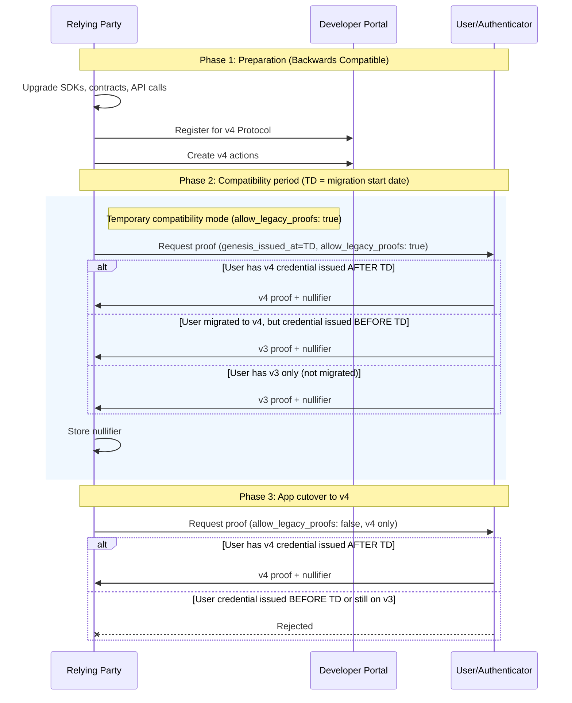
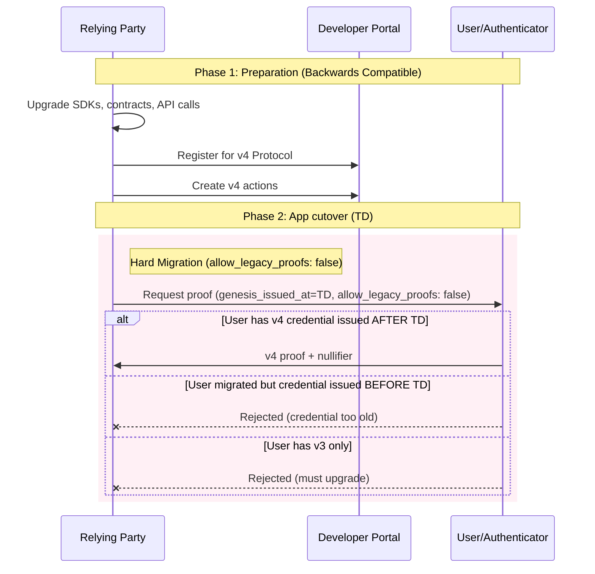
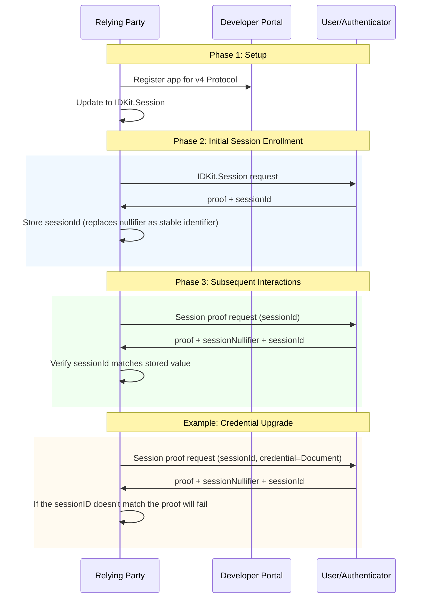

## Start Here

World ID 4.0 is available for new and existing integrations. New apps should
start with IDKit 4.x; existing apps should choose the migration path that
matches how they use World ID.

- Register or upgrade your app in the [Developer Portal](https://developer.worldcoin.org).
- Upgrade to IDKit 4.x (see below).
- Choose a migration path below based on your app's behavior.

### Uniqueness vs Session Proofs (3.0 to 4.0)

World ID 4.0 has two proof types:
- **Uniqueness proofs** for one-time checks.
- **Session proofs** for returning-user continuity (new in 4.0).

In 3.0, many RPs treated nullifiers as persistent user identifiers. In 4.0,
nullifiers are one-time-use, and `session_id` is the stable link across requests.

| Proof type | World ID 3.0 | World ID 4.0 | What your backend should store |
| --- | --- | --- | --- |
| Uniqueness proof | Nullifier prevented proof reuse. | Nullifier still prevents proof reuse and is one-time-use. | Used nullifiers. |
| Session proof (new in 4.0) | N/A. Nullifier were persistent. | `session_id` links the same user across requests. `session_nullifier` is per-proof replay protection. | `session_id` |

Rule of thumb: use `nullifier` for one-time uniqueness and `session_id` for continuity.

## Upgrading to IDKit 4.x 

Adopting World ID 4.0 requires upgrading to IDKit 4.x, which introduces major breaking changes to support the new protocol. What changed:

1. **RP context is required**: Requests now require `rp_context` (`rp_id`, `nonce`, `created_at`, `expires_at`, `signature`).
2. **IDKit response changed**: No longer reshape the payload or compute `signal_hash` for the verify endpoint.
3. **[Backend verification endpoint](/api-reference/developer-portal/verify) changed**: Use `POST /api/v4/verify/{rp_id}`.
4. `@worldcoin/idkit-standalone` is discontinued. Use `@worldcoin/idkit-core` for vanilla JS/browser.

For details and example code, see the [IDKit 4.0 integration guide](/world-id/idkit/integrate).

### Legacy credential compatibility

You can use IDKit 4.x even when a credential still uses a World ID 3.0 proof
flow. You do not need to downgrade the SDK.

| Credential | Current compatibility behavior |
| --- | --- |
| Selfie Check (Beta) | Request it with `selfieCheckLegacy()`. It currently returns World ID 3.0 proofs; World ID 4.0 Selfie Check is not yet available. |
| Device verification | `deviceLegacy()` is World ID 3.0-only and should be used only for existing integrations. World ID 4.0 does not have a Device preset; choose a current credential for new integrations. |


## Migration Path

Choose a migration path based on how you previously used World ID in your application.

### One time actions

These apps have a single long-running action.

**Examples:** A stamp for every verified human in the world. A token given to every human in the world once.

<Note>
  **Important:** `genesis_issued_at` is when the user originally got their
  credential (for example, went to an Orb), not when they upgraded their
  authenticator to v4. A user who was Orb-verified in 2023 and upgrades to v4
  in 2025 still has `genesis_issued_at` from 2023.
</Note>

#### Migration Flow Diagram

This diagram shows an app-controlled migration: preparation, a compatibility
period, and the point when your app stops accepting World ID 3.0 proofs.



**Summary:** During the compatibility period, the app accepts both v3 and v4
proofs. At the app's cutover, it begins accepting only v4 proofs.

<Warning>
  Before switching your app to v4-only, confirm that the users you support can
  produce the required v4 credentials. Choose the transition and cutover dates
  for your own rollout rather than relying on a fixed global schedule.
</Warning>

#### Step-by-step Migration Details

1. **Update SDKs and Contracts:** Upgrade SDKs, contracts, and API calls to enable baseline support for the upgraded protocol. This is backwards compatible.
2. **Register in Developer Portal:** Generate your new RP registration and relevant actions for the v4 protocol in the Developer Portal.
3. **For long-running actions:**
   - Decide a transition date (`TD`) to start accepting v4 proofs. Specify a minimum `genesis_issued_at = TD` timestamp in the IDKit request with `allow_legacy_proofs: true` as a temporary compatibility mode. Only users who get their Orb credential (or document credentials) from this point forward can generate v4 proofs. Users who have not upgraded their World ID can still issue v3 proofs during this window. Track both nullifiers.
   - At a future cut-off date (`CD > TD`), switch the IDKit request to `allow_legacy_proofs: false` to stop accepting v3 proofs and accept only v4 proofs.
4. **For limited-time actions** (for example, recurring grant drops): Make the transition at the action level. Short-running actions have a simpler migration path.

#### Example Code

**Old Contract - Disable minting here:**

```jsx Mint.sol
mapping(uint256 => bool) internal oldNullifierHashes;
mapping(address => bool) public oldHasMinted;

function mint(){
  // Existing logic for checking World ID uniqueness
  if (hasMinted[msg.sender]) revert AlreadyMinted();
  if (nullifierHashes[nullifierHash]) revert DuplicateNullifier(nullifierHash);
}
```

**New Contract - Check both old and new nullifiers:**

```ts Mintv4.sol
mapping(uint256 => bool) internal nullifierHashes;
mapping(address => bool) public hasMinted;

// This function is used to verify a 4.0 proof
function mint({..., nullifier}){
  // Check old contracts and new mapping
  if (OldContract.hasMinted[msg.sender] || hasMinted[msg.sender]) revert AlreadyMinted();
  if (OldContract.oldNullifierHashes[nullifier] || nullifierHashes[nullifier]) revert DuplicateNullifier(nullifier);

  // Verify 4.0 Proof
  Verifier.verify(...)
}

// Needed to support v3 proofs during migration
function mintLegacy({..., nullifierHash}){
  // Check old contracts and new ones
  if (OldContract.hasMinted[msg.sender] || hasMinted[msg.sender]) revert AlreadyMinted();
  if (OldContract.oldNullifierHashes[nullifierHash] || nullifierHashes[nullifierHash]) revert DuplicateNullifier(nullifierHash);

  // Verify Legacy Proof
  WorldIDRouter.verify(...)
}
```

### Short Term Recurring Actions

These apps create multiple one-time actions. These actions are short lived.

**Example:** A daily voting app where each vote requires a fresh proof of unique human.

**Migration approach:** Migrate your SDK and Developer Portal account. Pick a new future action to start accepting only v4 proofs.
#### Migration Flow Diagram

This diagram shows a simpler two-step migration with an app-controlled cutover.



**Summary:** At the app's cutover, new actions accept only v4 proofs.

### Recurring Verifications and New Credential Checks

For apps that rely on unlimited verifications of the same action.

**Examples:** Partners that check for users who've added new credentials. Apps that allow users to verify before each claim using the same action (note this is an anti-pattern of World ID).

**Migration approach:** Migrate to [Session Proofs](https://github.com/worldcoin/world-id-protocol/blob/main/docs/world-id-4-specs/README.md#session-proofs), which let you verify credentials over a period of time while ensuring it's the same user. The session ID returned in the proof becomes the long-lived stable identifier instead.

#### Migration Flow Diagram

This diagram shows how Session Proofs provide a stable identifier across multiple verifications.



**Summary:** Session IDs provide continuity across verifications, replacing nullifiers as the stable identifier.

```jsx Creating a session
export async function createSession() {
  const rpContext = await fetch("/api/worldid/rp-context").then((r) => r.json());

  const request = await IDKit.createSession({
    app_id: APP_ID,
    rp_context: rpContext,
  }).constraints(any(CredentialRequest("proof_of_human")));

  // Web only: render this QR URL
  const qrUrl = request.connectorURI;

  const completion = await request.pollUntilCompletion({ timeout: 120000 });
  if (!completion.success) throw new Error(completion.error);

  const verify = await fetch("/api/worldid/verify", {
    method: "POST",
    headers: { "Content-Type": "application/json" },
    body: JSON.stringify(completion.result),
  }).then((r) => r.json());

  if (!verify.success) throw new Error("Verification failed");

  // IMPORTANT: Save this in order to prove future sessions for the same user
  return completion.result.session_id;
}
```

```tsx Proving a session
// sessionId should have been saved when you created the session
export async function proveSession(sessionId) {
  const rpContext = await fetch("/api/worldid/rp-context").then((r) => r.json());

  const request = await IDKit.proveSession(sessionId, {
    app_id: APP_ID,
    rp_context: rpContext,
  }).constraints(any(CredentialRequest("proof_of_human")));

  const completion = await request.pollUntilCompletion({ timeout: 120000 });
  if (!completion.success) throw new Error(completion.error);

  const verify = await fetch("/api/worldid/verify", {
    method: "POST",
    headers: { "Content-Type": "application/json" },
    body: JSON.stringify(completion.result),
  }).then((r) => r.json());

  if (!verify.success) throw new Error("Verification failed");

  return verify;
}
```

### New Apps

New apps should start with IDKit 4.x and do not need a protocol migration path.

## Further Migration Details

- Recovery applies to users in the v4 protocol. Users with pre-v4 credentials
  may receive a new credential based on issuer policy, while `genesis_issued_at`
  still reflects original issuance date.
