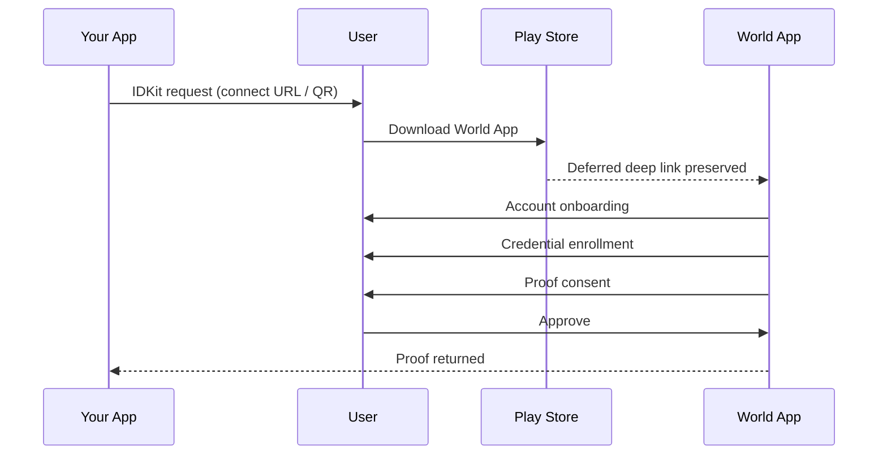
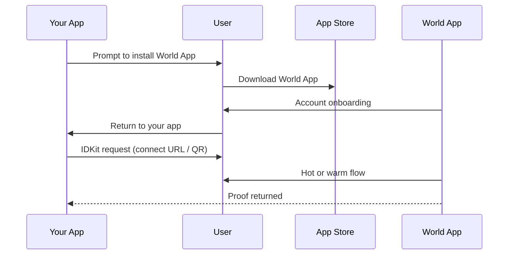
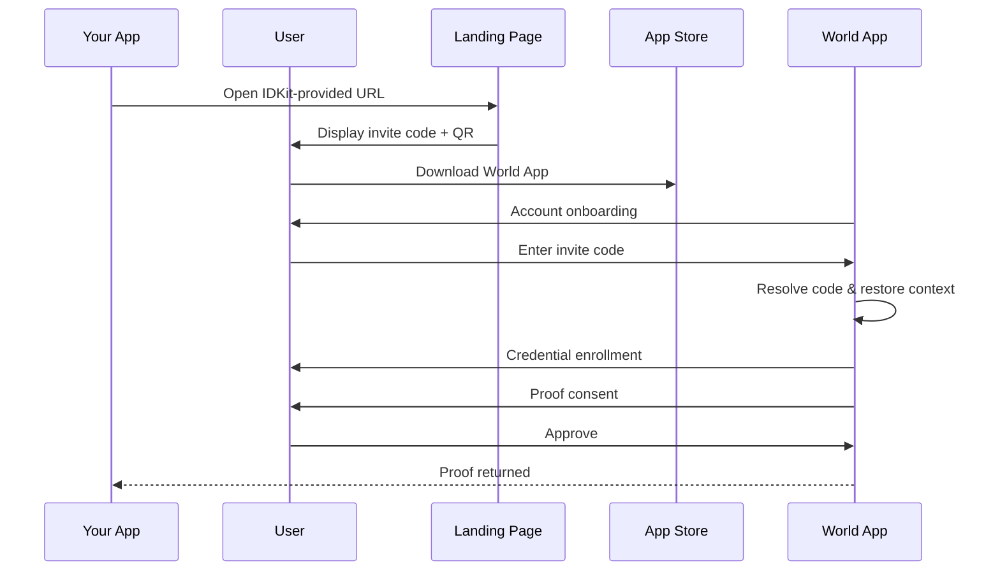

When your app requests a World ID proof, the user is taken through one of three flows based on two factors: whether they have World App installed, and whether they already hold the credential you're requesting.

| Flow | World App installed | Has credential | What happens |
| --- | --- | --- | --- |
| Hot | Yes | Yes | World App opens, displays a proof consent, and the user approves. Typically under 10 seconds. |
| Warm | Yes | No | World App opens and walks the user through credential enrollment (e.g., PoH, Face, or NFC). Once issued, a proof consent appears and the user approves. |
| Cold | No | No | The user must install World App first. The experience differs by platform — see below. |

## Cold flow

The cold flow requires the most steps and works differently on each platform because of how each platform handles **deferred deep linking** — the ability to preserve a link's context through an app store install so the app can act on it at first launch.

### Android

Android supports deferred deep linking through the Play Store. After the user downloads World App, the original verification context is carried forward at first launch — World App picks up where the user left off and routes them directly into credential enrollment.



### iOS

iOS does not support deferred deep linking through the App Store. The original verification context is lost during install, so additional mechanisms are needed to resume the flow.

#### Default behavior

1. The user downloads World App from the App Store and completes account creation onboarding.
2. Your app triggers an IDKit verification request.
3. World App opens and takes the user through a hot or warm flow.
4. The proof consent appears, the user approves, and the proof is returned to your app.



#### With invite-code mode

Invite-code mode displays a short 6-character code in your app that the user enters into World App. World App treats the code as an entry point to the in-app onboarding flows the user needs to complete in order to satisfy your IDKit request, then returns the proof.

<Note>
  Invite-code mode only applies to iOS as Android preserves deferred deep linking context via the Play Store.
</Note>

<Note>
  Only the `selfieCheckLegacy` preset is supported today.
</Note>

1. Your app triggers an IDKit invite-code request.
2. Your app opens the URL that IDKit provides. One of three paths follows:
   - **User has World App (mobile):** World App launches directly via deep link.
   - **User has World App (desktop):** The user scans the QR code with World App.
   - **User needs to install World App:** The user installs World App, completes account onboarding, then enters the invite code to resume the request.
3. World App restores the verification context, walks the user through credential enrollment if needed, and presents a proof consent.
4. The user approves and the proof is returned to your app.

The 6-character code persists across the App Store install, so once World App is installed and onboarded the user can resume the verification flow without returning to your app first. This also covers cross-device scenarios (e.g., a desktop browser displaying the QR for the user's phone) where deep linking cannot carry context.

##### Demo

<div style={{ marginBottom: "32px" }}>
  <video className="m-auto" width="700" autoPlay muted loop playsInline>
    <source src="/images/docs/world-id/idkit/invite-code-demo.mp4" type="video/mp4" />
  </video>
</div>

##### Flow diagram



<div style={{ marginBottom: "32px" }} />

##### Lifecycle

- Codes expire after a short TTL (currently fifteen minutes).
- Codes are one-shot — once redeemed, they cannot be reused. Re-running the request returns a fresh code with a fresh TTL.
- After the user redeems the code, your existing poll loop receives the proof exactly as it does in QR mode.

##### Integrate

The setup steps that precede the request — creating an app in the Developer Portal and generating an RP signature on your backend — are identical to the [standard integration](/world-id/idkit/integrate). Only the request call and the rendered UI change.

<CodeGroup title="Create an invite-code request">

```typescript
import { IDKit, selfieCheckLegacy } from "@worldcoin/idkit-core";

// `rpSig` is fetched from your backend — see the standard integration guide.
const request = await IDKit.requestWithInviteCode({
  app_id: "app_xxxxx",
  action: "my-action",
  rp_context: {
    rp_id: "rp_xxxxx",
    nonce: rpSig.nonce,
    created_at: rpSig.created_at,
    expires_at: rpSig.expires_at,
    signature: rpSig.sig,
  },
  allow_legacy_proofs: true,
  environment: "production",
}).preset(selfieCheckLegacy({ signal: "user-123" }));

// Open the landing page — displays invite code + QR
window.open(request.connectorURI, "_blank");

const completion = await request.pollUntilCompletion();
```

```tsx
import {
  IDKitInviteCodeRequestWidget,
  selfieCheckLegacy,
  type RpContext,
} from "@worldcoin/idkit";

const rpContext: RpContext = {
  rp_id: "rp_xxxxx",
  nonce: rpSig.nonce,
  created_at: rpSig.created_at,
  expires_at: rpSig.expires_at,
  signature: rpSig.sig,
};

<IDKitInviteCodeRequestWidget
  open={open}
  onOpenChange={setOpen}
  app_id="app_xxxxx"
  action="my-action"
  rp_context={rpContext}
  allow_legacy_proofs={true}
  preset={selfieCheckLegacy({ signal: "user-123" })}
  handleVerify={async (result) => {
    const response = await fetch("/api/verify-proof", {
      method: "POST",
      headers: { "content-type": "application/json" },
      body: JSON.stringify({ rp_id: rpContext.rp_id, idkitResponse: result }),
    });
    if (!response.ok) throw new Error("Backend verification failed");
  }}
  onSuccess={() => {
    // Update app state here.
  }}
/>;
```

```swift
import IDKit

// `rpSig` is fetched from your backend — see the standard integration guide.
let rpContext = try RpContext(
  rpId: "rp_xxxxx",
  nonce: rpSig.nonce,
  createdAt: rpSig.createdAt,
  expiresAt: rpSig.expiresAt,
  signature: rpSig.sig
)

let config = IDKitRequestConfig(
  appId: "app_xxxxx",
  action: "my-action",
  rpContext: rpContext,
  allowLegacyProofs: true,
  environment: .production
)

let request = try IDKit.request(config: config)
  .presetWithInviteCode(selfieCheckLegacy(signal: "user-123"))

// Open the landing page — displays invite code + QR
await UIApplication.shared.open(request.connectorURL)

let completion = await request.pollUntilCompletion()
```

</CodeGroup>

<Warning>
  Generate `rp_context` in your backend only. Never expose your RP signing key in client code.
</Warning>

The config object is the same one you pass to `IDKit.request(...)` — invite-code mode introduces no new required fields.

Set `allow_legacy_proofs: true` because `selfieCheckLegacy` is a v3 ("legacy") preset; the flag lets World App accept v3 proofs to satisfy the request. When invite-code mode adds support for v4 presets, set it to `false` for those flows.

Polling and proof verification are unchanged from QR mode: the same `Status` values are emitted and the same `IDKitCompletionResult` is returned. Forward the result payload as-is to `POST https://developer.world.org/api/v4/verify/{rp_id}` — see [Verify the proof in your backend](/world-id/idkit/integrate#step-5-verify-the-proof-in-your-backend).

##### SDK references

For the full surface — entry points, hook results, and type signatures — see the per-SDK reference:

- [JavaScript](/world-id/idkit/javascript#invite-code-mode)
- [React](/world-id/idkit/react#invite-code-mode)
- [Swift](/world-id/idkit/swift#invite-code-mode)
