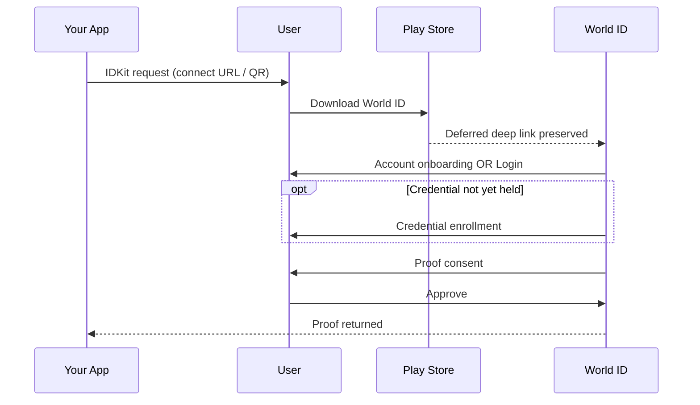
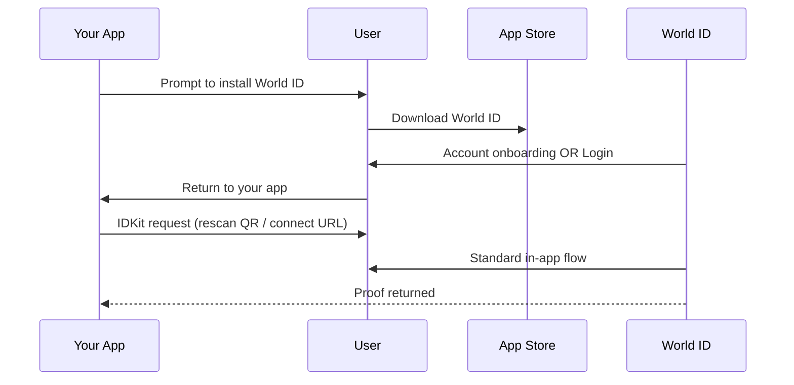

When your app requests a World ID proof, the user lands in one of three flows based on two factors: whether they have World ID installed, and — if not — whether they already have a World ID.

<Note>
  The integration flow is the same for all three paths, but the user experience differs.
</Note>

| Flow | World ID installed | Existing account | What happens |
| --- | --- | --- | --- |
| Hot | Yes | — | World ID opens, displays a proof consent, and the user approves. Typically under 10 seconds. If the user does not yet hold the requested [credential](/world-id/idkit/credentials), World ID walks them through enrollment first — your integration sees no difference. |
| Cold | No | No | The user installs World ID and completes account onboarding first. The experience differs by platform — see below. |
| Semi-cold | No | Yes | The user installs World ID and logs in to their existing account. **Android:** the flow resumes automatically. **iOS:** the user must return to your app and rescan, unless you use invite-code mode — see below. |

## Cold and semi-cold flows

Both flows require an install and work differently on each platform because of how each platform handles **deferred deep linking** — the ability to preserve a link's context through an app store install so the app can act on it at first launch.

### Android

Android supports deferred deep linking through the Play Store. After the user downloads World ID, they either create an account (cold) or log in to an existing one (semi-cold), then World ID resumes the verification flow automatically.

### iOS

iOS does not support deferred deep linking through the App Store. The original verification context is lost during install — for both cold and semi-cold users — so additional mechanisms are needed to resume the flow.

#### Default behavior

1. The user downloads World ID from the App Store and creates an account or logs in to an existing one.
2. The user returns to your app, which re-triggers the IDKit verification request (e.g., the user rescans the QR code).
3. World ID opens and takes the user through the standard in-app flow.
4. The proof consent appears, the user approves, and the proof is returned to your app.

#### With invite-code mode

Invite-code mode displays a short 6-character code in your app that the user enters into World ID. World ID treats the code as an entry point to the in-app onboarding flows the user needs to complete in order to satisfy your IDKit request, then returns the proof.

<Note>
  Invite-code mode exists because iOS lacks deferred deep linking — Android preserves the context via the Play Store.
</Note>

1. Your app triggers an IDKit invite-code request.
2. Your app opens the URL that IDKit provides. One of three paths follows:
   - **User has World ID (mobile):** World ID launches directly via deep link.
   - **User has World ID (desktop):** The user scans the QR code with World ID.
   - **User needs to install World ID:** The user installs World ID, completes account onboarding or logs in, then enters the invite code to resume the request.
3. World ID restores the verification context, walks the user through credential enrollment if needed, and presents a proof consent.
4. The user approves and the proof is returned to your app.

The 6-character code persists across the App Store install, so once World ID is installed and onboarded the user can resume the verification flow without returning to your app first. This also covers cross-device scenarios (e.g., a desktop browser displaying the QR for the user's phone) where deep linking cannot carry context.

**Demo**

  <video className="m-auto" width="700" autoPlay muted loop playsInline>
    <source src="/images/docs/world-id/idkit/invite-code-demo.mp4" type="video/mp4" />
  </video>

**Flow diagram**

**Lifecycle**

- Codes expire after a short TTL (currently fifteen minutes).
- Codes are one-shot — once redeemed, they cannot be reused. Re-running the request returns a fresh code with a fresh TTL.
- After the user redeems the code, your existing poll loop receives the proof exactly as it does in QR mode.

**Integrate**

Setup is identical to the [standard integration](/world-id/idkit/integrate) — only the request call changes. Only the `selfieCheckLegacy` preset is supported today. For code samples and migration guides, see the per-SDK sections: [JavaScript](/world-id/idkit/javascript#invite-code-mode), [React](/world-id/idkit/react#invite-code-mode), [Swift](/world-id/idkit/swift#invite-code-mode).
